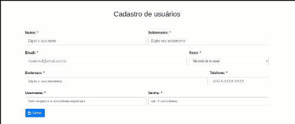

# **Fiap: Container Virtualization**

## **Trabalho anterior:**

[Trabalho de Microserviços](https://github.com/flavio-silva/microservices)

---

## **Trabalho Container Virtualization:**

Este trabalho é uma atualização do modelo de entrega do trabalho da matérias de microserviços, sendo refatorado com a adoção de helm charts, cada chart é composto por um deployment contendo uma regra de hpa.

**Foi reaproveitado o [docker-compose](docker-compose.yaml) da disciplina de Microservices lecionada pelo mesmo professor `André Pontes`.**

## **Requisitos para executar a Stack:**

`helm`

`nginx-ingress`

`rabbitmq-ha`

`mysql`

---

## **Criando a role binding de cluster **

`Executar no terminal:`

```sh
export ACCOUNT=$(gcloud info --format='value(config.account)')
kubectl create clusterrolebinding owner-cluster-admin-binding --clusterrole cluster-admin --user $ACCOUNT
```

---

## **Instanciando o Helm:**

Após instalado no seu computador o helm.

`Executar no terminal:`

```sh
helm init

kubectl --namespace kube-system create serviceaccount tiller

kubectl create clusterrolebinding tiller-cluster-rule --clusterrole=cluster-admin --serviceaccount=kube-system:tiller

kubectl --namespace kube-system patch deploy tiller-deploy -p '{"spec":{"template":{"spec":{"serviceAccount":"tiller"}}}}'
```

---

## **Instalando Rabbitmq:**

`Executar no terminal:`

```sh
helm install -n rabbitmq-ha stable/rabbitmq-ha
```

---

## **Instalando Mysql:**

`Executar no terminal:`

```sh
helm install -n mysql -f mysql/values.yaml mysql/
```

---

## **Instalando Frontend:**

`Executar no terminal:`

```sh
helm install -n frontend -f frontend/values.yaml frontend/
```

---

## **Instalando consumer:**

`Executar no terminal:`

```sh
helm install -n consumer-php -f consumer-php/values.yaml consumer-php/
```

---

## **Instalando fiap-microservice:**

`Executar no terminal:`

```sh
helm install -n fiap-microservice -f fiap-microservice/values.yaml fiap-microservice/
```

---
 
## **Testando o ambiente:**

Para simularmos o acesso a esta aplicação precisamos pegar o endereço do serviço do nginx-ingress e adicionar no hosts de seu computador burlando a resolução de DNS.

### **External IP:**

Adquirindo `EXTERNALIP`:

`Executar no terminal:`

```sh
kubectl get svc -n ops nginx-ingress-controller | grep -v EXTE |awk '{print $4}'
```

---

### **Editando o hosts:**

Endereço IP que vai estar no campo `EXTERNALIP`, e adiciona-lo dentro do arquivo `/etc/hosts`

`Executar no terminal:`

editando o `hosts`:

```sh
vim /etc/hosts

ExterrnalIP app.fiap.com.br
ExterrnalIP api.fiap.com.br
```

### **Jeito Facil:**

```sh
export external=$(kubectl get svc -n ops nginx-ingress-controller | grep -v EXTE |awk '{print $4}')

echo $external app.fiap.com.br >> /etc/hosts
echo $external api.fiap.com.br >> /etc/hosts
```

**Abrir o navegador e acessar o site [app.fiap.com.br](http://app.fiap.com.br), e ignorar o erro de ssl.**

**[Endereço da APLICAÇÃO](http://app.fiap.com.br)**

**[Endereço da API](http://api.fiap.com.br/api/person/v1/)**

---
### **Demonstrativo da aplicação:**



---

### **Grupo:**

Este Trabalho foi desenvolvido para à matéria de **Container e Virtualization** do **MBA - Fullstack developer, Microservices, Cloud e IOT**

`Pelos alunos:`

| Nome | RM|
|-------|:---:|
|**Flávio Alves Ferreira da Silva** |`RM: 333565`|
|**Milton Luiz Ribeiro Junior** |`RM: 333949`|
|**Pedro Madi Della Coletta** |`RM: 334109`|
|**Rafael Miranda de Almeida** |`RM: 333829`|
|**Rodrigo de Almeida Pereira** |`RM: 333241`|
|**Wellington Moreira Bastos** |`RM: 333878`|
|||

---

**AI É BRASIL!**

